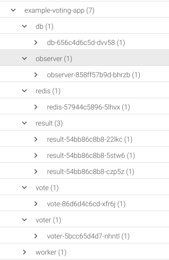

Logging into Sysdig Monitor, you should arrive at the Explore tab which offers an inventory overview where you can group the different resources or entities in your infrastructure using physical attributes like hostname and containers, or logical attributes Kubernetes namespaces, deployments and pods. For each entity we can see some basic metrics in the table like CPU, memory, network or I/O.

For example, change the grouping view to _Deployments and Pods_

You should be able to see the `example-voting-app` namespace with all the deployments and pods that make it up:

Proposed exercises
------------------

Let's try to answer some questions already:

- How many nodes do you have in your cluster?
- Can you see the Sysdig agent running on each node?
- Can you tell how many instances you run of each microservice in the voting app?
- Can you tell on which node each voting app microservice is currently running?
- Which microservice uses more CPU? And I/O?
- Which node has more memory usage? And disk usage?

Now we have an idea of the components of the app. But how do these microservices interact with each other? When votes are generated, we  expect traffic between the voter and the vote service. The result server will then check the database to generate the results.

With Sysdig Monitor you can use _Topology maps_ to visualize how entities interact with each other. When using a physical grouping we can see the different entities talking with each other, but with orchestration grouping we get a better understanding of how the Kubernetes-orchestrated services interact. With a service based grouping like Deployments and pods: Namespaces &gt; Deployments &gt; Pods we can select one of the default dashboards: `Topology` → `Network Traffic`. This will show us our entire infrastructure. But if we want to look only into a specific part, we will change from `Entire Infrastructure` into `example-voting-app` namespace. We call this changing the scope.

As we drill into these entities, we can see how we can even look inside the container, down to the process level. This is a really cool example of the deep visibility that Sysdig provides.

You can monitor several aspects of your application or cluster directly from Explore using the default Dashboards. There are a bunch of them available for Applications, Hosts & Containers, Kubernetes, Network, Services and Topology as we have just seen.

Proposed exercises
------------------

Using default dashboards, try to find out:

- Which technology is used for each voting app microservice? (identify each process running inside each container)
- Do we have any container CPU or memory limits on the containers?
