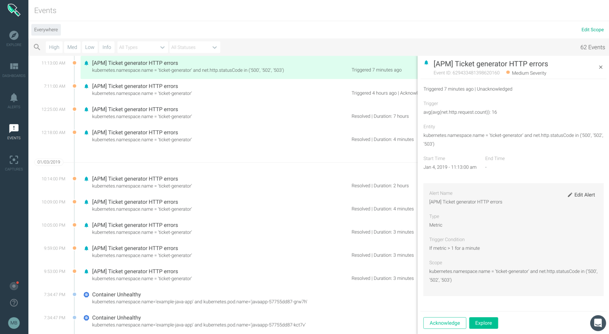

You will be able to see the event in the event stream:

If we go back to the Explore tab and explore the `net.http.error.count` metric segmented by `kubernetes.pod.name`:

It seems that the error is coming from the balancer deployment. Now it's time to dig real deep in the process forensics and network communication details, we need to use the Sysdig capture file associated with this event.
