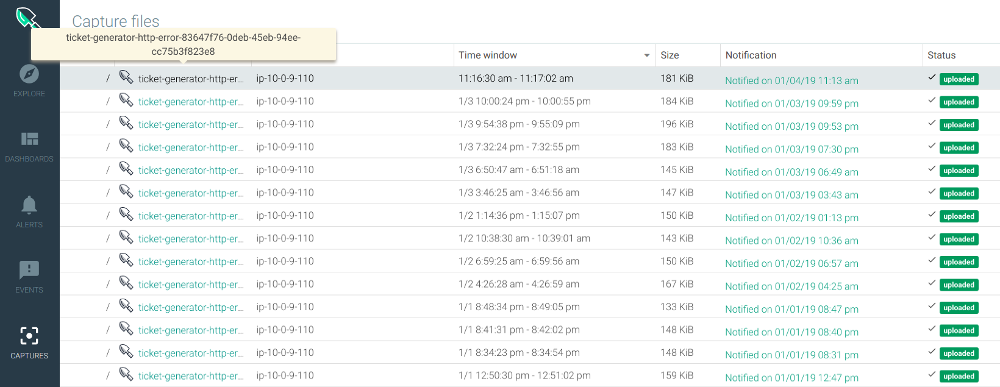
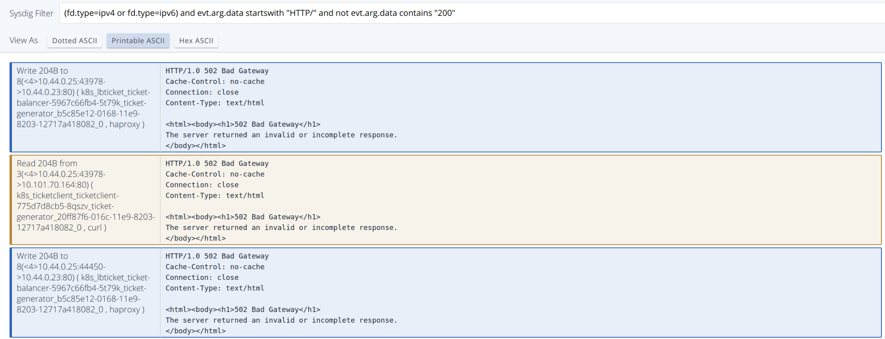
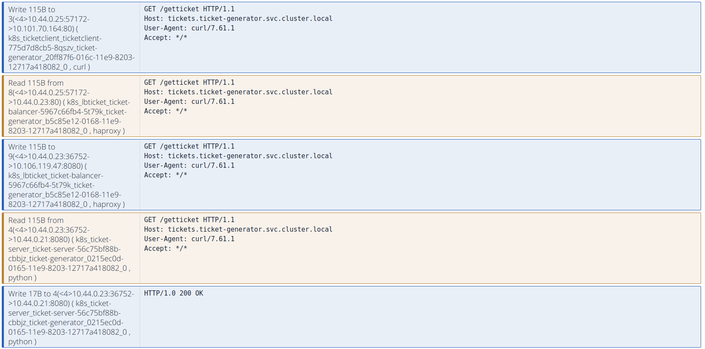
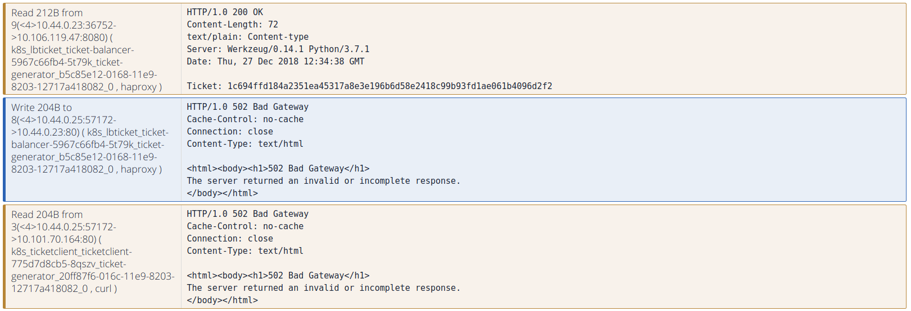

From the captures tab, we have access to all of the captures that were taken by Sysdig Monitor. We can open that with Sysdig Inspect, which is an interface built specifically for container troubleshooting, inspired by popular debugging tools like Wireshark.

Captures can be also downloaded to your device. In this case Sysdig Inspect can also be installed in your desktop, or you can use open source sysdig CLI or csysdig for analysis of the capture file. But for practical reasons will use the online version here.

Let's open the linked capture (`ticket-generator-http-error.scap`) from the captures tab:

Sysdig Inspect will open and we can see an overview. Each of these tiles aggregate different activities including file system and network, application protocols traffic, security events, performance indicators and logs.

This is how we are going to be able to navigate through thousands of system calls recorded in this capture file, so from a fired alert you can drill down and recreate everything that happened: modified files, network connections and executed commands. Using the sliders we can narrow our search around a specific time frame if we want.

The fist tile that catches our attention is the "HTTP errors" tile

If we drill down on that tile (the two downward arrows icons) and visualize the data using the "Printable ASCII" mode, we can get more detailed data on the error:

The error is a `502 - Bad Gateway The server returned an invalid or incomplete response`.

If you take a look at the headers (at the left) of the HTTP connection item you can see that all these `HTTP/1.0 502 Bad Gateway` error messages are related to the k8s_lbticket_ticket-balancer pod (our haproxy load balancer pod). From this error, we can deduce that the load balancer pod is having trouble receiving or understanding the response from the server pods.

We have the 12 HTTP requests that were interchanged in this conversation, let's go back to the overview and drill-down on the "HTTP Requests" tile and select again the "Printable ASCII" view mode.

The sysdig capture process starts asynchronously and there may be already several HTTP conversations in flight, so let's try to catch one of the HTTP flows from the beginning (the client requesting a new ticket).

Blue rows mean that we are sending a message (write syscall) while the orange row represents a received message (read syscall).

You should start with a sending message (blue) from the ticket-client container with the request: `GET /getticket`.

From there, you can follow the conversation easily:

- The client requests a new token to the load balancer.
- The load balancer receives this request.
- The load balancer (HAproxy process) sends a new request to the backend.
- The backend (ticket-server) container receives the request.
- The backend returns a 200 OK, so far, so good.

Now, the glitch that is causing the HTTP error (see first request):

- The balancer receives the response from the backend container. The body is correct and as expected, we have a new ticket, but the headers have a format which is not valid. The `text/plain: Content-type` header should be instead `Content-type: text/plain`. While this is ignored by some browsers (that's why it worked in the developer's laptop) and some HTTP proxies will be able to tolerate this invalid message, the HAproxy that we are using in this example is not.
- The HAproxy send the invalid response message to the client: 502 HTTP error: Bad Gateway.
- The client receives the HTTP response with the error.
