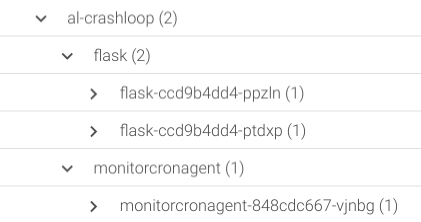

Logging into Sysdig Monitor, you should arrive at the Explore tab by default, the explore tab offers you an inventory overview where you can group the different entities using physical attributes - like host id - or logical attributes like pods, inside deployments, inside Kubernetes namespaces.

Once we have selected the desired grouping, you can monitor a single metric or a complete Dashboard.

For example, change the grouping view to Deployments and Pods

You should be able to see the `nginx-flask` namespace and the 2 deployments and 3 pods that make it up.

So far, we have deployed the first layer of our microservices architecture (the backend servers). Now, let's try to deploy the frontend nginx services that will balance the traffic to the backends:

`kubectl scale deployment nginx -n nginx-flask --replicas=2`{{execute}}

You will notice that the nginx pods don't show up in the Sysdig Monitor web interface, while the nginx namespace appears and disappears intermittently. What is happening?

`kubectl get pods -n nginx-flask`{{execute}}

Our `nginx` pods are in `CrashLoopBackOff` state!

What is a Kubernetes CrashLoopBackOff?
--------------------------------------

A CrashloopBackOff means that you have a pod starting, crashing, starting again, and then crashing again.

A PodSpec has a restartPolicy field with possible values Always, OnFailure, and Never which applies to all containers in a pod. The default value is Always and the restartPolicy only refers to restarts of the containers by the kubelet on the same node (so the restart count will reset if the pod is rescheduled in a different node). Failed containers that are restarted by the kubelet are restarted with an exponential back-off delay (10s, 20s, 40s …) capped at five minutes, and is reset after ten minutes of successful execution.

Why does a CrashLoopBackOff occur?
----------------------------------

Crash loop events happen very frequently when deploying to Kubernetes. Here are some of the umbrella causes for why they occur:

- The application inside the container keeps crashing
- Some type of parameters of the pod or container have been configured incorrectly
- An error has been made when deploying Kubernetes
- The cluster does not have enough resources to host the application
