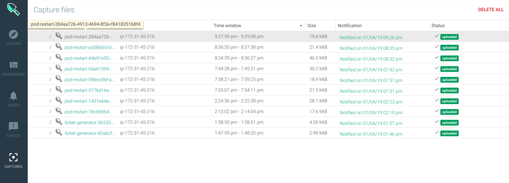

Let's scale the nginx deployment back to 0 pods:

`kubectl scale deployment nginx -n nginx-flask --replicas=0`{{execute}}

Make sure that you have enabled the `[Kubernetes] Pod CrashLoopBackOff`, and then, you can use a script included in this folder that will constantly try to spawn the nginx pods several times over 5 minutes:

`./generror.sh`{{execute}}

Leave the script running, it will finish and stop generating the error condition in a few minutes.

Wait a couple of minutes and then go back to the Explore tab, select the `nginx-flask` namespace and the metric `kubernetes.pod.restart.count`

There is a very sudden increase in pod restart events in this namespace.

If you go to the Events tab:

You will be able to see the different Back-off events coming from Kubernetes, and finally our own alert that has been triggered.

We configured this alert to automatically generate a Sysdig capture when fired, if we go now to the Captures tab, you should be able to see the corresponding capture file:

We have been able to pinpoint exactly **what** happened and the Kubernetes entities and events involved. Now, the Sysdig capture file will greatly help us discovering **why** it happened.
