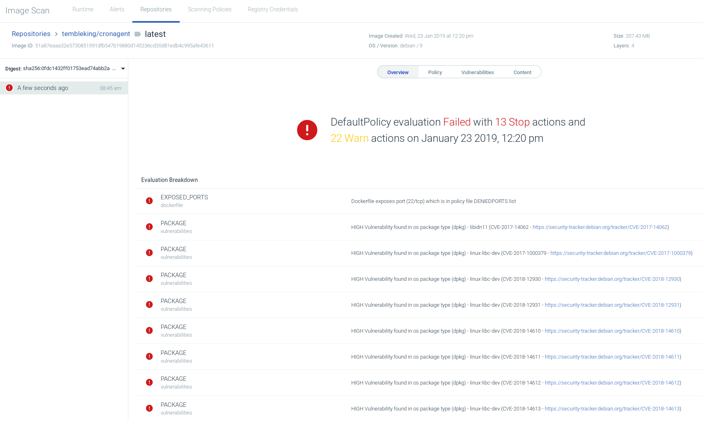
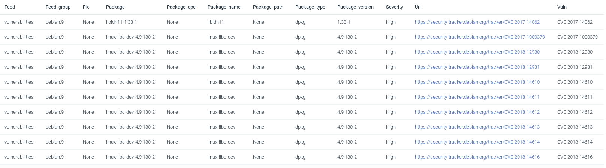

Once the plugin has finished scanning the image, the report seen in Jenkins should be also available in Sysdig Secure.

For each image that has been scanned, there’s an entry in Image Scanning > Repositories.

Click in the image and you will see all the information about the scan.

All the information about what did not succeed from the policy applied:

Operating System (base image) vulnerabilities:

But we can see as well application vulnerabilities, because since we have the full report of CVEs, we can scan also the libraries that our programs include:

