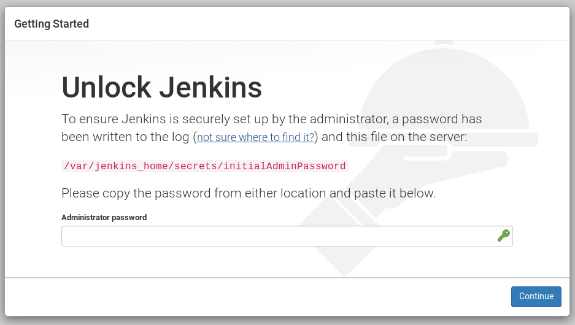
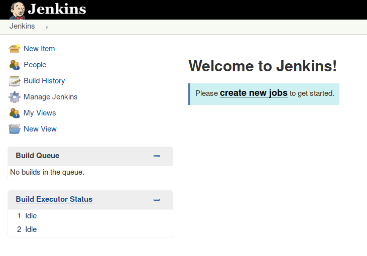

The `create.sh` script will allow you to deploy a Jenkins application with the plugin to integrate with Sysdig Secure image scanning.

`./create.sh`{{execute}}

The shell should be blocked right now, **don't close it**, because there is a port forwarded from the Kubernetes cluster to your own system.

You can access the Jenkins tab on the right or, alternatively, open this URL in your browser:

<https://[[HOST_SUBDOMAIN]]-31337-[[KATACODA_HOST]].environments.katacoda.com/>

You will see the following:

Use the administrator token displayed in the output of the terminal to unlock Jenkins.

Close the "Customize Jenkins" window by clicking the top right icon.
You don't need to execute plugin installation in Jenkins, because all the plugins are bundled in the Docker Image, with the correct version and will be installed with the execution of the next script.

You can ignore the warnings in the next window and click the Start using Jenkins button.

You will see the Jenkins front page with a Welcome message.

Next steps are populating the jobs and the plugins, and configuring Jenkins so it can connect with DockerHub and Sysdig Secure.
